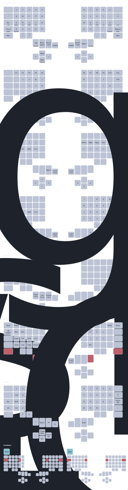

= Eden's qmk keyboard firmware
:experimental:

== Reference

.Tofu Reference
[%collapsible]
====

|===
| Leader | Adtion

|kbd:[G] kbd:[E]
|SOCD Enable

|kbd:[G] kbd:[Q]
|SOCD Disable

|kbd:[G] kbd:[A]
|SOCD Last

|kbd:[G] kbd:[D]
|SOCD Neutral

|kbd:[O] kbd:[R]
|Re-detect OS

|kbd:[O] kbd:[W]
|Set OS to Windows

|kbd:[O] kbd:[M]
|Set OS to Mac

|kbd:[O] kbd:[L]
|Set OS to Linux

|===

====

== Quick start

This repository uses https://github.com/qmk/qmk_firmware[qmk_firmware] as a submodule located in `./firmware`. Make sure
that you have https://github.com/casy/just[just] installed as this repository is built upon automating tasks with just
recipes. You should also use `nix` with `flake` support as this is the best way to setup the environment.

[source,bash]
----
# build all keyboards
just

# Build and flash a keyboard
just flash crkbd

# Write hand information to keyboard
just left crkbd
just right crkbd

# Format all c files
just fmt

# Generate keyboard reference svg
just layout
----

== Trouble shooting flashing on linux

If having issues with the bootloader being recongized, check is there is issues with
https://docs.qmk.fm/#/faq_build?id=can39t-program-on-linux[udev]. Also to view a list of usb devices run `lsusb`.

=== Nixos

For nixos, to be able to flash qmk it is required to have `hardware.keyboard.qmk.enable = true`.

=== External Userspace

Qmk's https://docs.qmk.fm/newbs_external_userspace[External Userspace] feature does not support defining a new keyboard.
This only supports defining keymaps, layouts and users mapings https://github.com/qmk/qmk_firmware/issues/23895#issuecomment-2159582796[(comment)].

== Resources and reference

* Posts
** https://precondition.github.io/home-row-mods[home-row-mods]
** https://getreuer.info/posts/keyboards/index.html[getreuer qmk library]
** https://sunaku.github.io/ergohaven-remnant-keyboard.html[sunaku keymap description]
** https://sunaku.github.io/home-row-mods.html[sunaku taming home row mods]

* Keymaps
** https://github.com/manna-harbour/miryoku[miryoku]
** https://github.com/rayduck/pnohty/tree/master[pnohty]
** https://github.com/precondition/dactyl-manuform-keymap[precondition]
** https://github.com/markstos/qmk_firmware/blob/markstos/keyboards/crkbd/keymaps/markstos/README.md[markstos]
** https://github.com/rafaelromao/keyboards[rafaelromao]
** https://github.com/filterpaper/qmk_userspace[filterpaper]

* Layouts
** https://github.com/sunaku/engrammer
