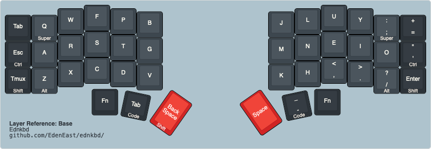
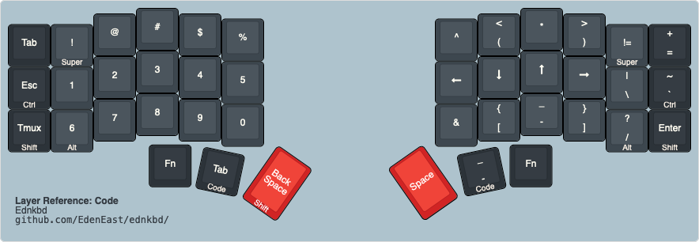
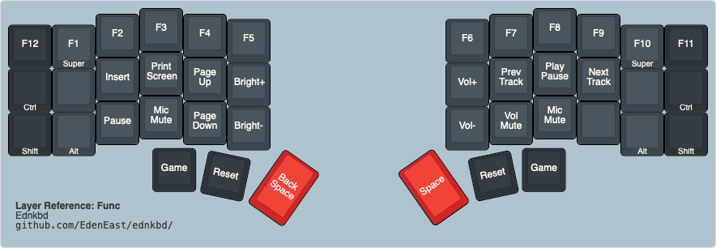
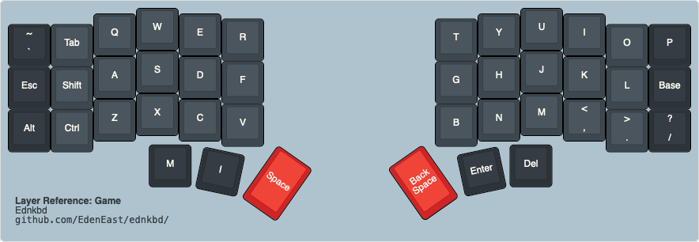

# Eden's Keyboard Firmware

## Base

[][base]

## Code

[][code]

## Func

[][func]

## Game

[][game]

[base]: http://www.keyboard-layout-editor.com/##@_backcolor=%23AEC3CD&switchMount=cherry&pcb:false&plate:true%3B&@_x:3&c=%233d474f&t=%23F7EEE3&a:7%3B&=F&_x:8%3B&=U%3B&@_y:-0.87&x:2%3B&=W&_x:1%3B&=P&_x:6%3B&=L&_x:1%3B&=Y%3B&@_y:-0.8799999999999999&x:5%3B&=B&_x:4%3B&=J%3B&@_y:-0.87&c=%232c3339%3B&=Tab&_c=%233d474f%3B&=Q%0A%0A%0A%0ASuper&_x:12&a:5%3B&=%2F:%0A%2F%3B%0A%0A%0ASuper&_c=%232c3339%3B&=+%0A%2F=%3B&@_y:-0.3799999999999999&x:3&c=%233d474f&a:7%3B&=S&_x:8%3B&=E%3B&@_y:-0.8700000000000001&x:2%3B&=R&_x:1%3B&=T&_x:6%3B&=N&_x:1%3B&=I%3B&@_y:-0.8799999999999999&x:5%3B&=G&_x:4%3B&=M%3B&@_y:-0.8700000000000001&c=%232c3339%3B&=Esc%0A%0A%0A%0ACtrl&_c=%233d474f%3B&=A&_x:12%3B&=O&_c=%232c3339&a:5%3B&=%22%0A'%0A%0A%0ACtrl%3B&@_y:-0.3799999999999999&x:3&c=%233d474f&a:7%3B&=C&_x:8&a:5%3B&=%3C%0A,%3B&@_y:-0.8700000000000001&x:2&a:7%3B&=X&_x:1%3B&=D&_x:6%3B&=H&_x:1&a:5%3B&=%3E%0A.%3B&@_y:-0.8799999999999999&x:5&a:7%3B&=V&_x:4%3B&=K%3B&@_y:-0.8700000000000001&c=%232c3339%3B&=Tmux%0A%0A%0A%0AShift&_c=%233d474f%3B&=Z%0A%0A%0A%0AAlt&_x:12&a:5%3B&=%3F%0A%2F%2F%0A%0A%0AAlt&_c=%232c3339&a:7%3B&=Enter%0A%0A%0A%0AShift%3B&@_y:-0.17999999999999972&x:11.75%3B&=Fn%3B&@_y:0.09999999999999964&c=%23cccccc&t=%232c3339&a:4&w:4.5&d:true%3B&=%3Cb%3ELayer%20Reference%2F:%20Base%3C%2F%2Fb%3E%0A%3Ctt%3Egithub.com%2F%2FEdenEast%2F%2Fednkbd%2F%2F%3C%2F%2Ftt%3E%0A%0A%0A%0A%0AEdnkbd%3B&@_ry:0.25&y:2.95&x:3.3&c=%232c3339&t=%23F7EEE3&a:7%3B&=Fn%3B&@_r:12&ry:1.75&y:0.5&x:4.8%3B&=Tab%0A%0A%0A%0ACode%3B&@_r:35&rx:6.5&ry:4.25&y:-0.75&x:-0.75&c=%23d12424&t=%23ffffff&h:1.5%3B&=Back%20Space%0A%0A%0A%0AShift%3B&@_r:-35&rx:13&y:-2.75&x:-3.0999999999999996&h:1.5%3B&=Space%3B&@_r:-12&rx:0&ry:0&y:5.55&x:9.55&c=%232c3339&t=%23F7EEE3&a:5%3B&=%2F_%0A-%0A%0A%0ACode
[code]: http://www.keyboard-layout-editor.com/##@_backcolor=%23AEC3CD&switchMount=cherry&pcb:false&plate:true%3B&@_x:3&c=%233d474f&t=%23F7EEE3&a:7%3B&=%23&_x:8%3B&=*%3B&@_y:-0.87&x:2%3B&=%2F@&_x:1%3B&=$&_x:6&a:5%3B&=%3C%0A(&_x:1%3B&=%3E%0A)%3B&@_y:-0.8799999999999999&x:5&a:7%3B&=%25&_x:4%3B&=%5E%3B&@_y:-0.87&c=%232c3339%3B&=Tab&_c=%233d474f%3B&=!%0A%0A%0A%0ASuper&_x:12%3B&=!%2F=%0A%0A%0A%0ASuper&_c=%232c3339&a:5%3B&=+%0A%2F=%3B&@_y:-0.3799999999999999&x:3&c=%233d474f&a:7%3B&=3&_x:8%3B&=%3Ci%20class%2F='fa%20fa-long-arrow-up'%3E%3C%2F%2Fi%3E%3B&@_y:-0.8700000000000001&x:2%3B&=2&_x:1%3B&=4&_x:6%3B&=%3Ci%20class%2F='fa%20fa-long-arrow-down'%3E%3C%2F%2Fi%3E&_x:1%3B&=%3Ci%20class%2F='fa%20fa-long-arrow-right'%3E%3C%2F%2Fi%3E%3B&@_y:-0.8799999999999999&x:5%3B&=5&_x:4%3B&=%3Ci%20class%2F='fa%20fa-long-arrow-left'%3E%3C%2F%2Fi%3E%3B&@_y:-0.8700000000000001&c=%232c3339%3B&=Esc%0A%0A%0A%0ACtrl&_c=%233d474f%3B&=1&_x:12&a:5%3B&=%7C%0A%5C&_c=%232c3339%3B&=%22%0A'%0A%0A%0ACtrl%3B&@_y:-0.3799999999999999&x:3&c=%233d474f&a:7%3B&=8&_x:8&a:5%3B&=%2F_%0A-%3B&@_y:-0.8700000000000001&x:2&a:7%3B&=7&_x:1%3B&=9&_x:6&a:5%3B&=%7B%0A%5B&_x:1%3B&=%7D%0A%5D%3B&@_y:-0.8799999999999999&x:5&a:7%3B&=0&_x:4%3B&=%2F&%3B&@_y:-0.8700000000000001&c=%232c3339%3B&=Tmux%0A%0A%0A%0AShift&_c=%233d474f%3B&=6%0A%0A%0A%0AAlt&_x:12&a:5%3B&=%3F%0A%2F%2F%0A%0A%0AAlt&_c=%232c3339&a:7%3B&=Enter%0A%0A%0A%0AShift%3B&@_y:-0.17999999999999972&x:11.75%3B&=Fn%3B&@_y:0.09999999999999964&c=%23cccccc&t=%232c3339&a:4&w:4.5&d:true%3B&=%3Cb%3ELayer%20Reference%2F:%20Code%3C%2F%2Fb%3E%0A%3Ctt%3Egithub.com%2F%2FEdenEast%2F%2Fednkbd%2F%2F%3C%2F%2Ftt%3E%0A%0A%0A%0A%0AEdnkbd%3B&@_ry:0.25&y:2.95&x:3.3&c=%232c3339&t=%23F7EEE3&a:7%3B&=Fn%3B&@_r:12&ry:1.75&y:0.5&x:4.8%3B&=Tab%0A%0A%0A%0ACode%3B&@_r:35&rx:6.5&ry:4.25&y:-0.75&x:-0.75&c=%23d12424&t=%23ffffff&h:1.5%3B&=Back%20Space%0A%0A%0A%0AShift%3B&@_r:-35&rx:13&y:-2.75&x:-3.0999999999999996&h:1.5%3B&=Space%3B&@_r:-12&rx:0&ry:0&y:5.55&x:9.55&c=%232c3339&t=%23F7EEE3&a:5%3B&=%2F_%0A-%0A%0A%0ACode
[func]: http://www.keyboard-layout-editor.com/##@_backcolor=%23AEC3CD&switchMount=cherry&pcb:false&plate:true%3B&@_x:3&c=%233d474f&t=%23F7EEE3&a:7%3B&=F3&_x:8%3B&=F8%3B&@_y:-0.87&x:2%3B&=F2&_x:1%3B&=F4&_x:6%3B&=F7&_x:1%3B&=F9%3B&@_y:-0.8799999999999999&x:5%3B&=F5&_x:4%3B&=F6%3B&@_y:-0.87&c=%232c3339%3B&=F12&_c=%233d474f%3B&=F1%0A%0A%0A%0ASuper&_x:12%3B&=F10%0A%0A%0A%0ASuper&_c=%232c3339%3B&=F11%3B&@_y:-0.3799999999999999&x:3&c=%233d474f%3B&=Print%20Screen&_x:8%3B&=Play%20Pause%3B&@_y:-0.8700000000000001&x:2%3B&=Insert&_x:1%3B&=Page%20Up&_x:6%3B&=Prev%20Track&_x:1%3B&=Next%20Track%3B&@_y:-0.8799999999999999&x:5%3B&=Bright+&_x:4%3B&=Vol+%3B&@_y:-0.8700000000000001&c=%232c3339%3B&=%0A%0A%0A%0ACtrl&_c=%233d474f%3B&=&_x:12%3B&=&_c=%232c3339%3B&=%0A%0A%0A%0ACtrl%3B&@_y:-0.3799999999999999&x:3&c=%233d474f%3B&=Mic%20Mute&_x:8%3B&=Mic%20Mute%3B&@_y:-0.8700000000000001&x:2%3B&=Pause&_x:1%3B&=Page%20Down&_x:6%3B&=Vol%20Mute&_x:1%3B&=%3B&@_y:-0.8799999999999999&x:5%3B&=Bright-&_x:4%3B&=Vol-%3B&@_y:-0.8700000000000001&c=%232c3339%3B&=%0A%0A%0A%0AShift&_c=%233d474f%3B&=%0A%0A%0A%0AAlt&_x:12%3B&=%0A%0A%0A%0AAlt&_c=%232c3339%3B&=%0A%0A%0A%0AShift%3B&@_y:-0.17999999999999972&x:11.75%3B&=Game%3B&@_y:0.09999999999999964&c=%23cccccc&t=%232c3339&a:4&w:4.5&d:true%3B&=%3Cb%3ELayer%20Reference%2F:%20Func%3C%2F%2Fb%3E%0A%3Ctt%3Egithub.com%2F%2FEdenEast%2F%2Fednkbd%2F%2F%3C%2F%2Ftt%3E%0A%0A%0A%0A%0AEdnkbd%3B&@_ry:0.25&y:2.95&x:3.3&c=%232c3339&t=%23F7EEE3&a:7%3B&=Game%3B&@_r:12&ry:1.75&y:0.5&x:4.8%3B&=Reset%3B&@_r:35&rx:6.5&ry:4.25&y:-0.75&x:-0.75&c=%23d12424&t=%23ffffff&h:1.5%3B&=Back%20Space%3B&@_r:-35&rx:13&y:-2.75&x:-3.0999999999999996&h:1.5%3B&=Space%3B&@_r:-12&rx:0&ry:0&y:5.55&x:9.55&c=%232c3339&t=%23F7EEE3%3B&=Reset
[game]: http://www.keyboard-layout-editor.com/##@_backcolor=%23AEC3CD&switchMount=cherry&pcb:false&plate:true%3B&@_x:3&c=%233d474f&t=%23F7EEE3&a:7%3B&=W&_x:8%3B&=U%3B&@_y:-0.87&x:2%3B&=Q&_x:1%3B&=E&_x:6%3B&=Y&_x:1%3B&=I%3B&@_y:-0.8799999999999999&x:5%3B&=R&_x:4%3B&=T%3B&@_y:-0.87&c=%232c3339&a:5%3B&=~%0A%60&_c=%233d474f&a:7%3B&=Tab&_x:12%3B&=O&_c=%232c3339%3B&=P%3B&@_y:-0.3799999999999999&x:3&c=%233d474f%3B&=S&_x:8%3B&=J%3B&@_y:-0.8700000000000001&x:2%3B&=A&_x:1%3B&=D&_x:6%3B&=H&_x:1%3B&=K%3B&@_y:-0.8799999999999999&x:5%3B&=F&_x:4%3B&=G%3B&@_y:-0.8700000000000001&c=%232c3339%3B&=Esc&_c=%233d474f%3B&=Shift&_x:12%3B&=L&_c=%232c3339%3B&=Base%3B&@_y:-0.3799999999999999&x:3&c=%233d474f%3B&=X&_x:8%3B&=M%3B&@_y:-0.8700000000000001&x:2%3B&=Z&_x:1%3B&=C&_x:6%3B&=N&_x:1&a:5%3B&=%3C%0A,%3B&@_y:-0.8799999999999999&x:5&a:7%3B&=V&_x:4%3B&=B%3B&@_y:-0.8700000000000001&c=%232c3339%3B&=Alt&_c=%233d474f%3B&=Ctrl&_x:12&a:5%3B&=%3E%0A.&_c=%232c3339%3B&=%3F%0A%2F%2F%3B&@_y:-0.17999999999999972&x:11.75&a:7%3B&=Del%3B&@_y:0.09999999999999964&c=%23cccccc&t=%232c3339&a:4&w:4.5&d:true%3B&=%3Cb%3ELayer%20Reference%2F:%20Game%3C%2F%2Fb%3E%0A%3Ctt%3Egithub.com%2F%2FEdenEast%2F%2Fednkbd%2F%2F%3C%2F%2Ftt%3E%0A%0A%0A%0A%0AEdnkbd%3B&@_ry:0.25&y:2.95&x:3.3&c=%232c3339&t=%23F7EEE3&a:7%3B&=M%3B&@_r:12&ry:1.75&y:0.5&x:4.8%3B&=I%3B&@_r:35&rx:6.5&ry:4.25&y:-0.75&x:-0.75&c=%23d12424&t=%23ffffff&h:1.5%3B&=Space%3B&@_r:-35&rx:13&y:-2.75&x:-3.0999999999999996&h:1.5%3B&=Back%20Space%3B&@_r:-12&rx:0&ry:0&y:5.55&x:9.55&c=%232c3339&t=%23F7EEE3%3B&=Enter

This repository contains my personal keymap for my [Dactyl Manuform][dactman-repo] and [Corne] keyboard.

This keymap uses [Colemak-DH] for its alpha base.

This keymap is the third iteration of my quest for a keymap that fits my needs. This current
iteration takes a lot if insperation from the default keymap for the [ferris] keyboard.

[colemak-dh]: https://colemakmods.github.io/mod-dh/
[rs]: https://github.com/qmk/qmk_firmware/blob/2d5c16/keyboards/crkbd/keymaps/rs/readme.md
[miryoku]: https://github.com/manna-harbour/qmk_firmware/blob/miryoku/users/manna-harbour_miryoku/miryoku.org
[dactman-repo]: https://github.com/edeneast/dactyl-manuform
[corne]: https://github.com/foostan/crkbd
[ferris]: https://github.com/qmk/qmk_firmware/tree/master/keyboards/ferris/keymaps/default

## Quick start

This repository uses [qmk_firmware] as a submodule located in `external/qmk_firmware`. Make sure you
have [Just] installed as this repository is built upon automation of build using just recipes. You
should also use `nix-shell` to make sure you have the correct development environment to build the
firmware. Make sure you update your submodules before trying to execute nix-shell

```bash
# Enter a development shell
nix-shell

# Build the corne keymap
just crkbd

# Build the dactyl-manuform keymap
just dact

# Or all
just
```

[qmk_firmware]: https://github.com/qmk/qmk_firmware
[just]: https://github.com/casey/just

## 40% Layout

This is a layout made to be keyboard agnostic as I use multiple keyboards. The base layout is
designed for a split ortho / column staggered 3x6 with 3 thumb buttons.

## Ideas, Concepts, and Rationals

-   40% layout with 3x6 layout keeps all keys to within one key distance from the homerow.
-   No homerow mods. [home row mods][homerowmod] are popular, I have used them as well, but found that
    it slowed me down and was too much mental tax.
-   Symbols on one layer, numbers and navigation one another.

## Trouble shooting flashing on linux

If having issues with the bootloader being recongnized check issue with [udev]. Also to view list of
usb devices run `lsusb`.

[udev]: https://beta.docs.qmk.fm/faqs/faq_build#linux-udev-rules-id-linux-udev-rules

## Resources and References

-   [Miryoku]
-   [ferris](https://github.com/qmk/qmk_firmware/tree/master/keyboards/ferris/keymaps/default)
-   [markstos](https://github.com/markstos/qmk_firmware/blob/markstos/keyboards/crkbd/keymaps/markstos/README.md)
-   [rs](https://github.com/qmk/qmk_firmware/tree/master/keyboards/crkbd/keymaps/rs)
-   [Precondition](https://github.com/precondition/dactyl-manuform-keymap/)
-   [Rsta](https://github.com/rstacruz/my_qmk_keymaps)
-   [curry](./external/qmk_firmware/users/curry/README.md)
