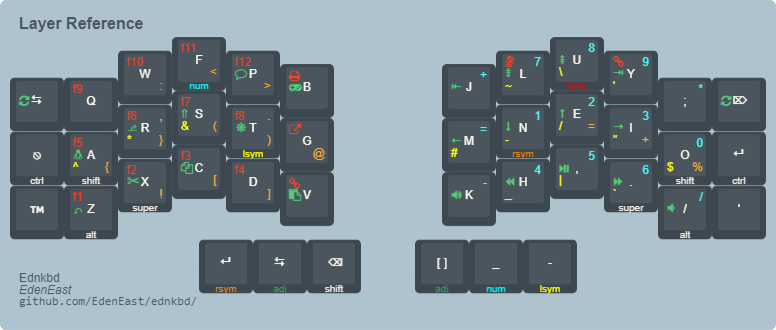

# Eden's Keyboard Firmware

<p align="center">
  
</p>

This repository contains my personal keymap for my [Dactyl Manuform][dactman-repo] and [Corne] keyboard.

This keymap uses [Colemak-DH] for its alpha base with the ability to swap to Qwerty when needed.
It is also heavily inspired/based off of [Miryoku], an ergonomic, minimal, orthogonal layout for
ergo or ortho keyboards.

[Colemak-DH]: https://colemakmods.github.io/mod-dh/
[Miryoku]: https://github.com/manna-harbour/qmk_firmware/blob/miryoku/users/manna-harbour_miryoku/miryoku.org
[dactman-repo]: https://github.com/edeneast/dactyl-manuform
[Corne]: https://github.com/foostan/crkbd

## Quick start

This repository uses [qmk_firmware] as a submodule located in `external/qmk_firmware`. Make sure you
have [Just] installed as this repository is built upon automation of build using just recipes. You
should also use `nix-shell` to make sure you have the correct development environment to build the
firmware. Make sure you update your submodules before trying to execute nix-shell

```bash
# Enter a development shell
nix-shell

# Build the corne keymap
just crkbd

# Build the dactyl-manuform keymap
just dact

# Or all
just
```

[qmk_firmware]: https://github.com/qmk/qmk_firmware
[Just]: https://github.com/casey/just

## 40% Layout

This is a layout made to be keyboard agnostic as I use multiple keyboards. The base layout is
designed for a split ortho / column staggered 3x6 with 3 thumb buttons.

## Ideas, Concepts, and Rationals

- 40% layout with 3x6 layout keeps all keys to within one key distance from the homerow.
- No homerow mods. [home row mods][homerowmod] are popular, I have used them as well, but found that
    it slowed me down and was too much mental tax.
- Symbols on one layer, numbers and navigation one another.

## Trouble shooting flashing on linux

If having issues with the bootloader being recongnized check issue with [udev]. Also to view list of
usb devices run `lsusb`.

[udev]: https://beta.docs.qmk.fm/faqs/faq_build#linux-udev-rules-id-linux-udev-rules

## Resources and References

- [Miryoku]
- [ferris](https://github.com/qmk/qmk_firmware/tree/master/keyboards/ferris/keymaps/default)
- [rs](https://github.com/qmk/qmk_firmware/tree/master/keyboards/crkbd/keymaps/rs)
- [Precondition](https://github.com/precondition/dactyl-manuform-keymap/)
- [Rsta](https://github.com/rstacruz/my_qmk_keymaps)
- [curry](./external/qmk_firmware/users/curry/README.md)
